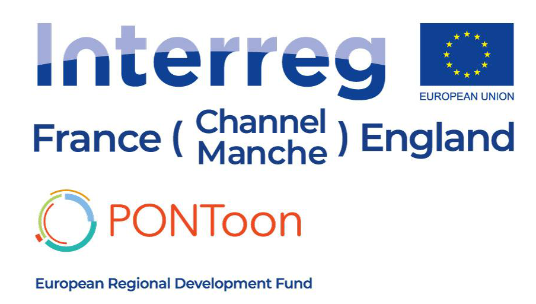

# PONToonVRTrain
 
The PONToon VR Train is a VR app which allows the user to enter a digital recreation of 2 train stations in order to help build their confidence beofre moving into a realworld situation which may require them to buy a ticket or wait for their trains. 
This project contains all that is needed to build the app itself for the Oculus Quest. Included are the 2 stations, all gameplay features such as purchasing tickets from ticket machines, guards or booths, accessing platforms via ticket operated barriers, wandering NPCs, delay/platform alteration events system and platform noticeboards. When built the app will run on the Oculus Quest via sideloading using SideQuest.    

<p align="center">
  
</p>

```bash
Budget received from the France (Channel) England Programme: €4 million ERDF
Total Project Budget: €5.79 million
Project Duration: 3.5 years
```

## About PONToon
PONToon is an exciting project that will use a range of new and developing technologies such as games development, 3D/virtual reality, social media and web/mobile apps to engage, support and up-skill women in order to aid their employment opportunities.

The project is centred around community development, social and economic inclusion and equality. It aims to produce a method of working that's not only scalable and transferrable but also applicable to broader demographic sets and geographical regions for continuing impact.

PONToon will employ digital tools and methods to provide equal access to training and employment services in response to the digital skills shortage existing across all sectors of work. PONToon will provide a more flexible approach to existing training/employment services increasing efficiency and quality due to the dual effect of the toolkit enhancing both technical digital skills and core competencies for employment.
```bash
Budget received from the France (Channel) England Programme: €4 million ERDF
Total Project Budget: €5.79 million
Project Duration: 3.5 years
```

## Prerequisites

[Unreal Engine](https://www.unrealengine.com/en-US/download) is required to build the PONToon VR Train app.

```bash
Unreal version: 4.23.1 
Platforms    : Windows, Android, Oculus Quest
```
